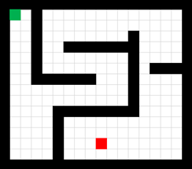

# Appendix F – Solve a maze

## Introduction
In this assignment you will solve a maze using a genetic algorithm. The maze you will solve is a 2D maze that consists of square cells. A cell is either open or a wall. You can move around on the open cells. The goal is to find a path from the starting cell to the end cell. Below is an example of a maze where you start on the red cell and try to find the green goal cell. 
 

## Assignment
Write a program that solves a maze as described in the introduction with a genetic algorithm. To help you get started there is a list with hints and points you need to address when writing this program.
1.	First make a way to represent the 2D maze in your program.
2.	The DNA of an individual is a sequence of moves that it runs over. A sequence of moves could for example be [Right, Right, Right, Up, Up, Up, Right, Right, Down]. Make sure the sequence is long enough to reach the goal cell of your maze! If you try to move to a cell with a wall the move is simply ignored and you stay in the cell you were.
3.	Think of a fitness function that gives a score to how well an individual is performing. Some ideas are: positive points for the total distance from where you started, negative points for bumping into a wall, negative points for the distance to the goal after the sequence of moves has been executed. Be creative with thinking of scores!
4.	In the genetic algorithm you should crossover the DNA of two individuals that score roughly the same on the fitness function. This means that like in the 8 queen example you swap parts of the sequence of moves. After this also some random mutation can be applied to the offspring.
5.	Let only the best performing individuals of the offspring live (and don’t feel sorry for those who didn’t make it...)

## Output
