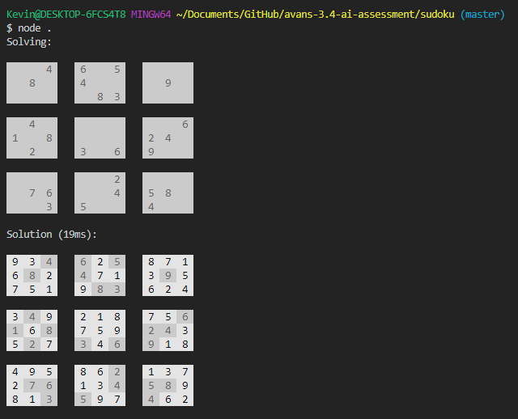

# Appendix E – Solve a killer sudoku

## Introduction
A killer sudoku is a variant of the classical sudoku. Its main difference lays in the fact that in a killer sudoku no squares are filled with numbers beforehand. Instead some areas are indicated with additional numbers which represent the sum of the squares involved. A popular description may be found here.

## Assignment
Implement a program that solves a killer sudoku by using CSP (Constraint Satisfaction Problem).

## Altered assignment
Since the killer sudoku is worth 1 point, we asked Dion Koeze (teacher) to alter the assignment to a normale sudoku solver for 1/2 point.

## Output
